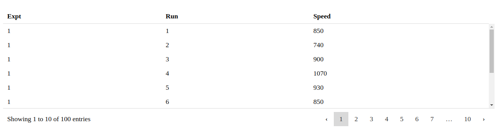

# dc-datatable

`dc-datatable` is jquery-free lightweight dc.js addon library to represent data in a tabular format.

## Screenshot



## Quick start

You can follow one of the below methods.

##### Install using Npm

```bash
npm install dc-datatable
```

##### Install from Yarn

```bash
yarn add dc-datatable
```

##### Using Git repository

Clone the repository

`git clone https://github.com/privateOmega/dc-datatable.git`

##### Build from source

```bash
npm run build && npm run build_umd
```

## Usage

This library is developed as an ES6 module but output is generated in UMD, systemJS and Common JS formats as well.

##### Include as a module:

```javascript
import { Datatable } from "dc-datatable";

new Datatable(div, "chartGroup");
```

##### Including files:

```xml
<script src="/path/to/dc-datatable.js"></script>
<script>
	new dcDatatables.Datatable(div, "chartGroupName");
</script>
```

##### Dependencies:

`dc-datatable` depends externally on **[dc.js](https://github.com/dc-js/dc.js)**.

To run the example, you have to include **[d3.js](https://github.com/d3/d3)** and **[crossfilter2](https://github.com/crossfilter/crossfilter)**

#### Initialization

Initialization is same as for any other chart in dc.js:

```javascript
const chart = dcDatatable.Datatable(div, "chartGroupName");
```

## Methods

Initialization looks like this:

```javascript
const chart = dcDatatable.Datatable("#tableview", "chartGroupName");
```

##### int size(int size)

Get or set the table size which determines the number of rows displayed in a page.

```javascript
const size = chart.size();
chart.size(25);
```

##### void columns(string appId)

Gets or sets column settings to be used. Check out: https://github.com/fiduswriter/Simple-DataTables/wiki/columns

```javascript
chart.columns([
  // Sort the second column in ascending order
  { select: 1, sort: "asc" },
  // Set the third column as datetime string matching the format "DD/MM/YYY"
  { select: 2, type: "date", format: "DD/MM/YYYY" },
  // Disable sorting on the fourth and fifth columns
  { select: [3, 4], sortable: false },
  // Hide the sixth column
  { select: 5, hidden: true },
  // Append a button to the seventh column
  {
    select: 6,
    render: function(data, cell, row) {
      return (
        data +
        "<button type='button' data-row='" +
        row.dataIndex +
        "'>Select</button>"
      );
    }
  }
]);
```

##### void order(func order)

Gets or sets default sort type used in the chart.

```javascript
chart.order(d3.ascending);
```

##### bool enableSort(bool enable)

Get status or enable/disable sorting.

```javascript
chart.enableSort(true);
```

##### bool enableSearch(bool enable)

Get status or enable/disable searching.

```javascript
chart.enableSearch(true);
```

##### bool enablePaging(bool enable)

Get status or enable/disable paging.

```javascript
chart.enablePaging(true);
```

##### bool enableScrolling(bool enable)

Get status or enable/disable scrolling.

```javascript
chart.enableScrolling(true);
```

##### string scrollY(string scrollY)

Get or set scrolling options.

```javascript
chart.scrollY("200px");
```

##### bool enablePagingSizeChange(bool enable)

Get status or enable/disable paging size change dropdown.

```javascript
chart.enablePagingSizeChange(true);
```

##### void enableHeader((bool enable)

Get status or set whether to show or hide header row.

```javascript
chart.enableHeader(true);
```

##### void enableFooter((bool enable)

Get status or set whether to show or hide footer row.

```javascript
chart.enableFooter(true);
```

##### bool enableAutoWidth(bool enable)

Get status or enable/disable automatic column width calculation.

```javascript
chart.enableAutoWidth(true);
```

#### Chaining

All of the exposed methods return `dc-datatable` object so chaining subsequent calls is possible.
An example of this would be:

```javascript
const chart = dc.Datatable(".container", "name");
chart.enableHeader(false).enableAutoWidth(true); // and so on...
```

## Copyright and license

Licensed under [MIT license](LICENSE).
